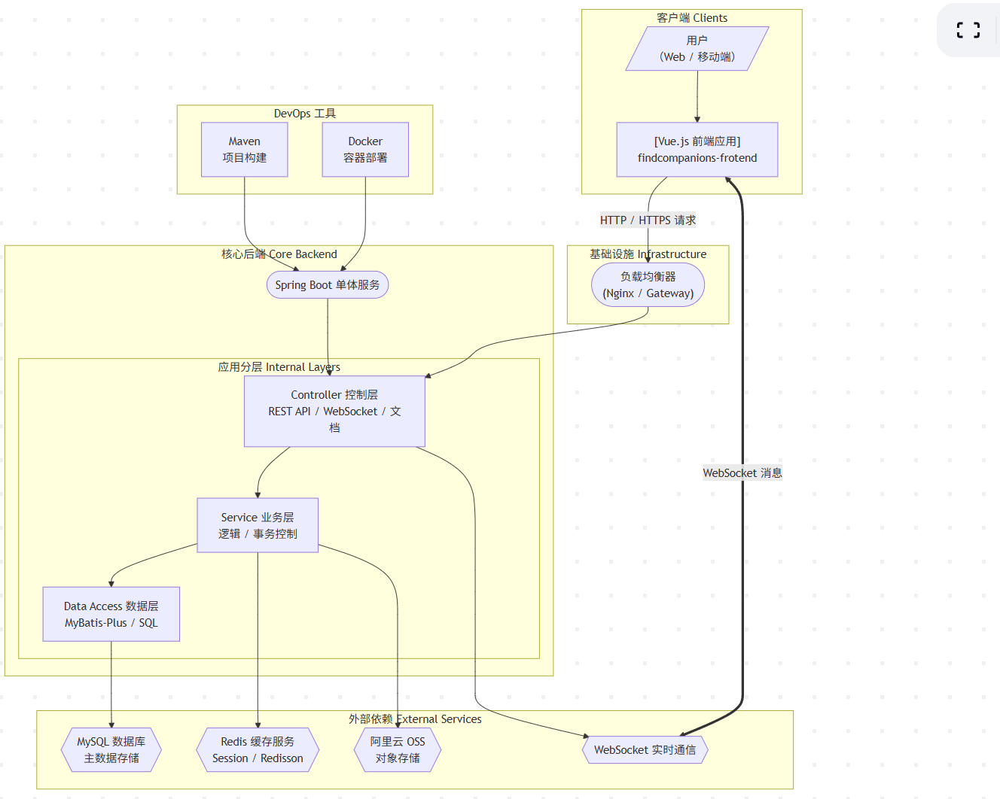

# FindCompandions - 寻伴

<p align="center">
  
  
  
  
  
  
</p>

**FindCompandions** 是一个高效、便捷的伙伴匹配平台，旨在帮助用户快速找到志同道合的伙伴。项目后端基于 Spring Boot 构建，采用前后端分离架构，集成了 MyBatis-Plus、Redis、WebSocket、Knife4j 等现代化技术栈，提供用户管理、智能推荐、组队、实时聊天等一系列核心功能。

## ✨ 核心功能

-   **👤 用户模块**:
    -   用户注册与登录（基于Session）
    -   个人信息管理（昵称、头像、标签等）
    -   根据标签智能推荐伙伴
-   **👥 队伍模块**:
    -   创建、解散、更新队伍
    -   公开/加密队伍，支持密码加入
    -   按关键词或条件搜索队伍
    -   加入与退出队伍管理
-   **💬 实时通信模块**:
    -   基于 WebSocket 的私聊与大厅聊天功能
    -   聊天记录持久化存储
-   **☁️ 文件存储**:
    -   集成阿里云OSS，支持用户头像等文件上传。

## 🏛️ 系统架构

项目采用经典的单体分层架构，并为分布式部署做好了准备。通过引入Redis实现Session共享和缓存，利用WebSocket实现实时通信。



## 🛠️ 技术栈

| 技术 | 名称 | 版本/说明 |
| :--- | :--- | :--- |
| **核心框架** | Spring Boot | `2.6.4` |
| **数据库** | MySQL | `8.0.33` |
| **数据访问** | MyBatis-Plus | `3.5.1`，强大的ORM框架 |
| **缓存** | Redis | 用于数据缓存和分布式Session |
| **分布式组件**| Redisson | `3.17.5`，高级Redis客户端，提供分布式锁等 |
| **实时通信** | WebSocket | Spring Boot Starter |
| **API文档** | Knife4j | `4.4.0`，基于Swagger的增强版UI |
| **对象存储** | 阿里云OSS | `3.17.4` |
| **JSON处理** | Gson & FastJSON | |
| **构建工具** | Maven | `3.x` |
| **开发语言** | Java | `1.8` |

## 🚀 快速启动

请确保您的本地环境已安装并启动以下应用：
-   JDK 1.8
-   Maven 3.x
-   MySQL 8.x
-   Redis

#### 1. 克隆项目

```bash
git clone https://github.com/scrazyakai/Find-Compandions
cd findCompandions
```

#### 2. 初始化数据库

1.  连接到您的MySQL数据库。
2.  创建一个新的数据库，例如 `findcompandionsdb`。
3.  执行项目根目录下 `sql/create_table.sql` 脚本来创建所需的表结构。

#### 3. 修改配置文件

打开 `src/main/resources/application.yml`，根据您的本地环境修改以下配置：

-   **数据库连接**:
    ```yaml
    spring:
      datasource:
        url: jdbc:mysql://localhost:3306/find_compandions?useSSL=false&serverTimezone=UTC
        username: your_mysql_username
        password: your_mysql_password
    ```
-   **Redis连接**:
    ```yaml
    spring:
      redis:
        host: localhost
        port: 6379
        database: 0 # 可选，默认为0
    ```
-   **阿里云OSS**: (如果需要测试文件上传功能)
    > **安全提示**: 强烈建议使用环境变量来配置密钥，避免硬编码。
    ```yaml
    aliyun:
      oss:
        endpoint: oss-cn-beijing.aliyuncs.com
        accessKeyId: ${OSS_ACCESS_KEY_ID}      # 环境变量
        accessKeySecret: ${OSS_ACCESS_KEY_SECRET} # 环境变量
        bucketName: your_bucket_name
    ```

#### 4. 运行项目

您可以通过IDE直接运行 `FindCompanionsApplication.java`，或者使用Maven命令行：

```bash
# 清理并打包项目
mvn clean package

# 运行生成的jar文件
java -jar target/findCompandions-0.0.1-SNAPSHOT.jar
```

## 📖 API接口文档

项目启动后，即可访问由 **Knife4j** 生成的增强版API文档。

-   **访问地址**: [http://localhost:8080/api/doc.html](http://localhost:8080/api/doc.html)

您可以在此页面上浏览所有API接口、查看请求/响应详情并直接进行在线调试。

## 📁 项目结构

```
findCompandions/
├── sql/
│   └── create_table.sql         # 数据库建表脚本
├── src/
│   └── main/
│       ├── java/com/akai/
│       │   ├── common/          # 通用工具、常量、返回码
│       │   ├── config/          # 应用配置 (Swagger, WebSocket, etc.)
│       │   ├── controller/      # API 控制器
│       │   ├── exception/       # 全局异常处理器
│       │   ├── model/           # 数据模型 (DO, DTO, VO)
│       │   ├── service/         # 业务逻辑服务
│       │   └── FindCompanionsApplication.java # Spring Boot 启动类
│       └── resources/
│           ├── mapper/          # MyBatis-Plus Mapper XML
│           └── application.yml  # 核心配置文件
└── pom.xml                      # Maven 依赖管理
```

## 🤝 贡献

欢迎所有形式的贡献！如果您发现了Bug或有任何改进建议，请随时提交 **Issue** 或 **Pull Request**。

1.  Fork 本仓库
2.  创建您的特性分支 (`git checkout -b feature/AmazingFeature`)
3.  提交您的更改 (`git commit -m 'Add some AmazingFeature'`)
4.  推送到分支 (`git push origin feature/AmazingFeature`)
5.  打开一个 Pull Request

## 📄 开源许可

本项目采用 [MIT License](LICENSE) 开源许可。
